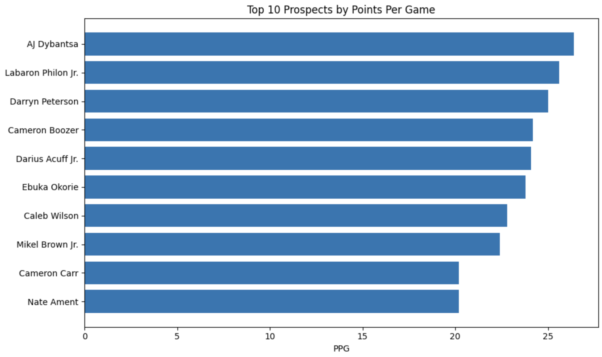
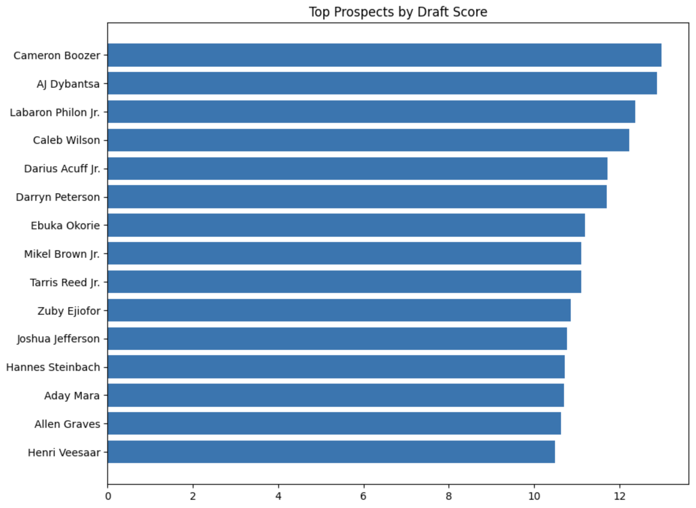
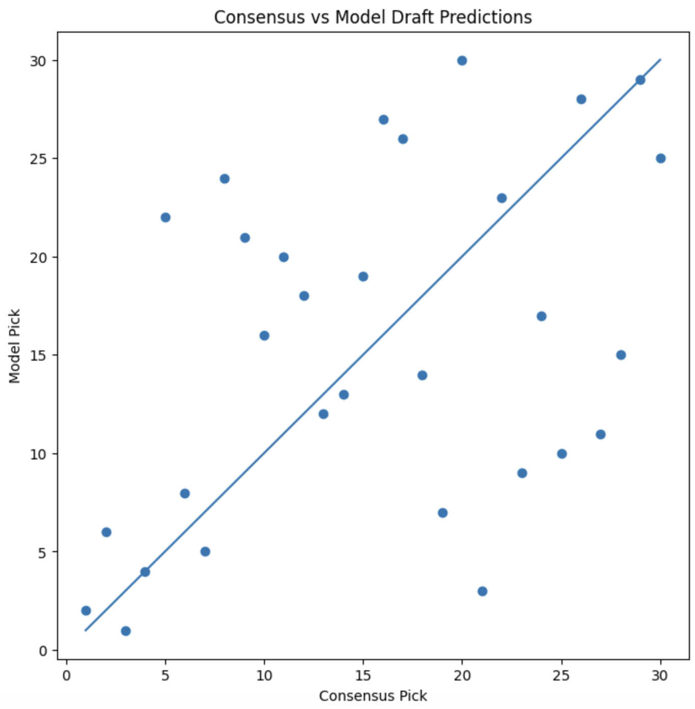
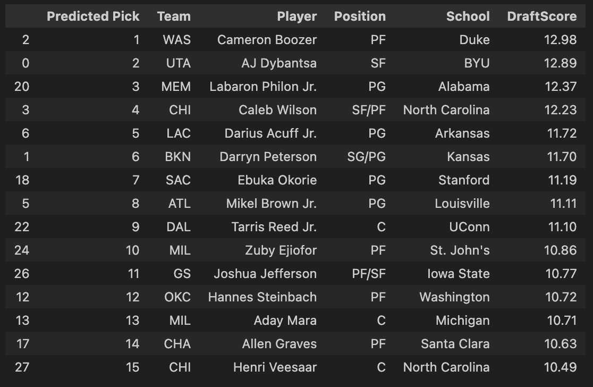

# NBA Draft Predictor 2026

## Overview

This project develops a custom NBA Draft prediction model using prospect performance statistics from the projected 2026 NBA Draft class. The goal is to compare a data-driven ranking system against consensus mock draft projections and identify potential draft risers and fallers.

Rather than relying on scouting reports or expert rankings, this model evaluates prospects based solely on their statistical production and generates an independent draft board.

---

## Project Objectives

* Analyze projected first-round NBA Draft prospects
* Develop a custom prospect evaluation metric
* Generate a complete first-round draft prediction
* Compare model rankings against consensus mock draft rankings
* Identify players the model values more or less highly than consensus projections

---

## Dataset

The dataset contains projected first-round prospects and includes:

* Draft Position
* Team
* Player
* Position
* School
* Age
* Points Per Game (PPG)
* Rebounds Per Game (RPG)
* Assists Per Game (APG)
* Blocks Per Game (BPG)
* Steals Per Game (SPG)

Data was compiled from publicly available 2026 NBA Draft projections and prospect statistics.

---

## Methodology

A custom **DraftScore** metric was developed to evaluate each prospect:

DraftScore =

* 40% Scoring Production (PPG)
* 20% Rebounding (RPG)
* 20% Playmaking (APG)
* 10% Rim Protection (BPG)
* 10% Defensive Activity (SPG)

Players were ranked according to DraftScore, producing a complete projected first-round draft board.

---

## Key Visualizations

### Top Scoring Prospects

This visualization highlights the highest-scoring projected first-round prospects based on points per game.

---

### Top Prospects by Draft Score

Prospects ranked according to the custom DraftScore metric developed for this project.

---

### Consensus vs Model Predictions

Comparison of consensus mock draft positions against model-generated draft rankings.

---

### Final Predicted Draft Board

Complete first-round draft board generated by the model.

### Top Scoring Prospects

Displays the highest-scoring projected first-round prospects.

### Top Prospects by DraftScore

Ranks players according to the custom evaluation model.

### Consensus vs Model Predictions

Compares consensus mock draft positions against model-generated draft positions.

---

## Model Results

### Top 10 Predicted Picks

| Pick | Team | Player             |
| ---- | ---- | ------------------ |
| 1    | WAS  | Cameron Boozer     |
| 2    | UTA  | AJ Dybantsa        |
| 3    | MEM  | Labaron Philon Jr. |
| 4    | CHI  | Caleb Wilson       |
| 5    | LAC  | Darius Acuff Jr.   |
| 6    | BKN  | Darryn Peterson    |
| 7    | SAC  | Ebuka Okorie       |
| 8    | ATL  | Mikel Brown Jr.    |
| 9    | DAL  | Tarris Reed Jr.    |
| 10   | MIL  | Zuby Ejiofor       |

---

## Notable Findings

### Biggest Model Risers

* Labaron Philon Jr.
* Joshua Jefferson
* Zuby Ejiofor
* Tarris Reed Jr.
* Henri Veesaar

### Biggest Model Fallers

* Keaton Wagler
* Kingston Flemings
* Brayden Burries
* Christian Anderson
* Chris Cenac Jr.

The model generally favors highly productive college players and rewards statistical performance regardless of age or perceived NBA upside.

---

## Limitations

This model evaluates prospects solely using box-score statistics and does not incorporate:

* Athletic testing
* Physical tools
* Team fit
* Scouting evaluations
* Long-term development potential
* Historical draft trends

As a result, the model tends to rank older, statistically productive players more highly than traditional mock drafts.

---

## Future Improvements

Potential extensions include:

* Team need adjustments
* Position-specific weighting
* Historical NBA Draft training data
* Machine learning draft position prediction
* Prospect similarity analysis
* Draft accuracy evaluation using actual 2026 NBA Draft results

---

## Technologies Used

* Python
* Pandas
* NumPy
* Matplotlib
* Jupyter Notebook

---

## Author

Prisha A.

University of Illinois Urbana-Champaign
Mechanical Engineering | Data Science Minor
