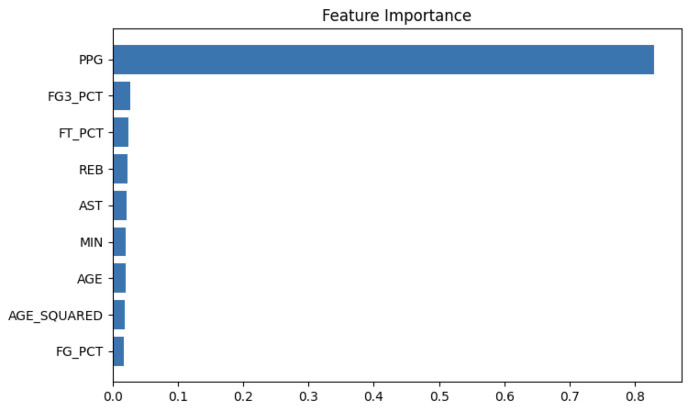
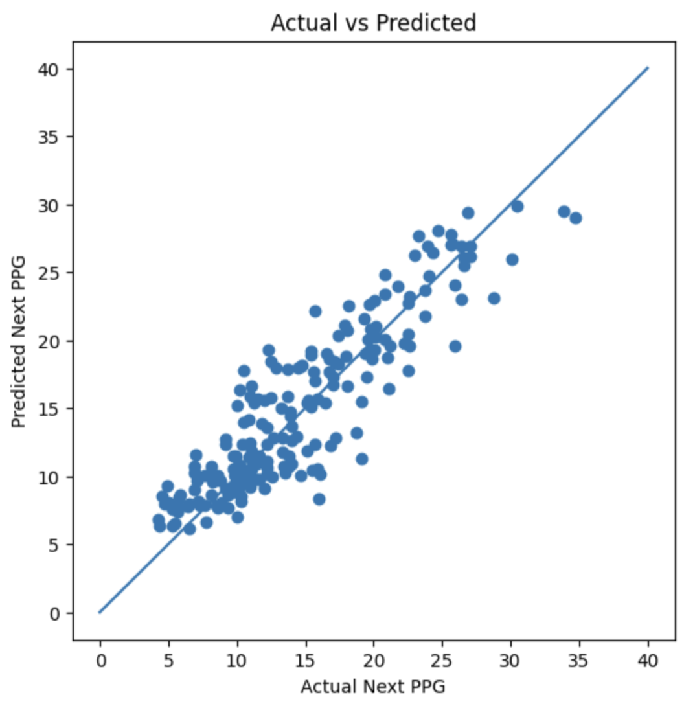
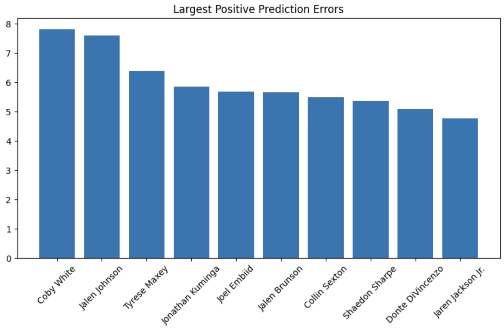
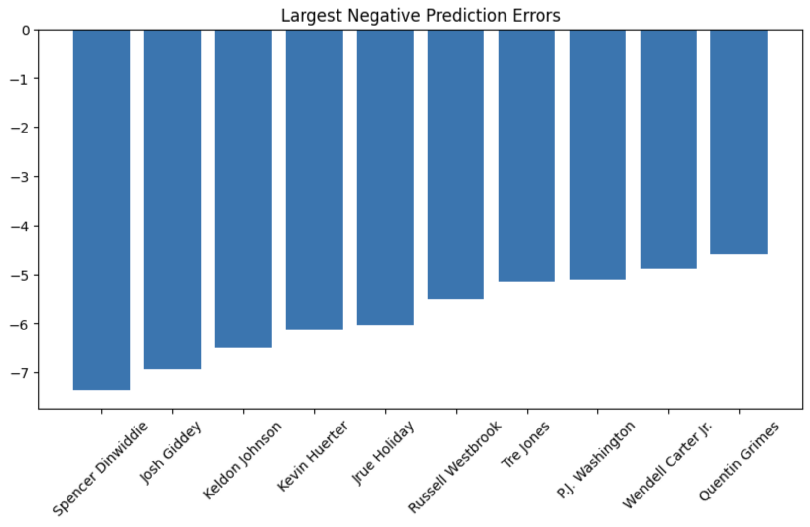

# NBA Player Scoring Prediction

## Overview

This project uses machine learning to predict an NBA player's scoring
performance in the following season using historical NBA statistics.

Data was collected directly from the NBA API across multiple seasons,
processed using Python and Pandas, and used to train predictive machine
learning models.

The project follows a complete data science workflow including data
collection, feature engineering, model training, model evaluation, and
error analysis.

---

## Project Goal

The goal of this project is to determine whether historical player
statistics can be used to accurately predict future scoring production.

Initially, total points scored (NEXT_PTS) were used as the prediction
target. However, total points are heavily influenced by injuries and
games missed. To better measure player scoring ability, the project was
refined to predict next-season Points Per Game (NEXT_PPG).

---

## Data Collection

Data was collected using the NBA API for the following seasons:

- 2020-21
- 2021-22
- 2022-23
- 2023-24
- 2024-25

Player statistics from each season were combined into a single dataset
and aligned so that each player's current-season statistics could be
used to predict their next-season performance.

---

## Features Used

The final model used:

- Age
- Age²
- Points Per Game (PPG)
- Assists Per Game (AST)
- Rebounds Per Game (REB)
- Minutes Played (MIN)
- Field Goal Percentage (FG%)
- Three Point Percentage (3PT%)
- Free Throw Percentage (FT%)

---

## Models Evaluated

### Linear Regression

Mean Absolute Error (MAE):

```text
~1.99 PPG
```

### Random Forest Regression

Mean Absolute Error (MAE):

```text
~2.24 PPG
```

Linear Regression produced the best overall performance and was selected
as the final model.

---

## Key Findings

- Current PPG is the strongest predictor of future PPG.
- Shooting efficiency contributes additional predictive power.
- Linear Regression slightly outperformed Random Forest.
- Breakout seasons and unexpected declines remain difficult to predict.

---

## Visualizations

### Feature Importance



### Actual vs Predicted PPG



### Largest Positive Prediction Errors



### Largest Negative Prediction Errors



---

## Technologies Used

- Python
- Pandas
- NumPy
- Matplotlib
- Scikit-Learn
- NBA API
- Jupyter Notebook

---

## Future Improvements

- Include advanced player tracking statistics
- Incorporate injury and availability data
- Test Gradient Boosting and XGBoost models
- Expand dataset to additional NBA seasons
